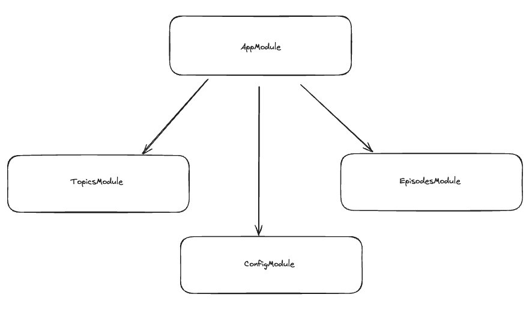
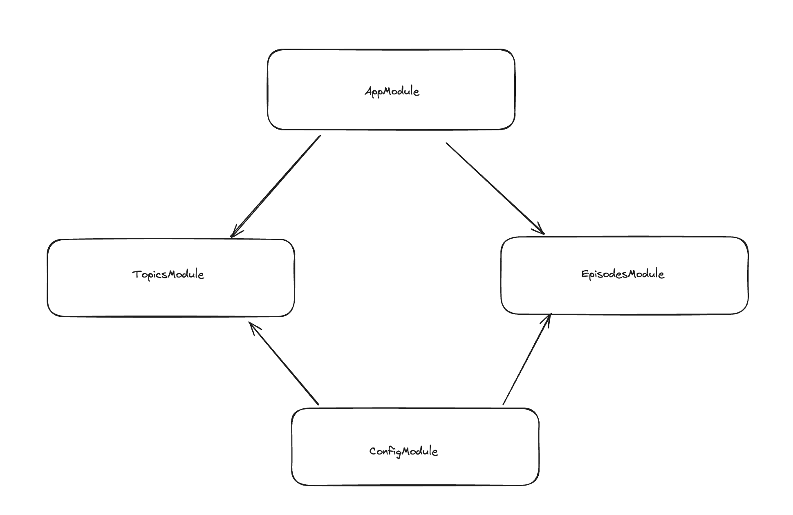

# Nestjs

This project aim to handle the fundamental of nestjs framework, step by step in this readme I will explain how it work, core concept to get good understanding of that technologoies. The project will be a podcast api.

## Core concept

### `@Decorators`

In Nest, Decorators are everywhere, so this why need to see this notion at first.

#### Decorators are not magic, there a functions

These functions can be apply to classes, methods, and even method parameter. A decorators will add extra functionalities, metadata to the class, method or parameters they apply to, and some decorators will have extra parameters to control they behavior. That we can see on the `app.module.ts` file:

`app.module.ts`:

```ts
@Module({
  imports: [],
  controllers: [AppController],
  providers: [AppService],
})
export class AppModule {}
```

This `Decorators` take a configuration object as argument, to apply a specific behavior to the `AppModule` class. It is use specifically for `Module` classes. Explanation of the code above:

- ```@Module``` organizes related controllers, services, and other elements.

- ```imports: []``` allowing to import other modules into this module. In this case, it's empty because we don't importing anything.

- ```controllers: [AppController]``` is the lists of controllers that are part of this module. In this case, we have ```AppController```, which likely handles routing and requests.

- ```providers: [AppService]``` is the lists of services (like ```AppService```) that can be **injected** into controllers or other providers via dependency injection. These services are used to handle business logic, connect to databse, or interact with external API's.

- ```AppModule``` is the class that becomes the root module of our application. This is where NestJS looks for how to wire the application components together.

Types of `Decorators`:

- **Class Decorators**: We have other `Decorators` for different type of class like `@Controllers`, `@Injectable`, etc.

- **Method Decorators**: Also for methods as mentioned above, often use for routes or middlewares.
  For instance, ```@Get()```, ```@Post()```, ```@useGuards()```, etc.
- **Parameter Decorators**: Applied to parameters to inject specific types of data. Examples include ```@Params()```, ```@Body()```, and ```@Query```.

- **Property Decorators**: Used to inject dependencies into class properties, like `@Inject()` or `@Optional()`.

### Modules

Nestjs is opiniated, so we have some constraint to force us to write and structure our application in a specific way. The strong recommendation is to structure our code in modules, every Nest app have the root module which is `AppModule`, and that root module can use other modules which themselve can use other modules and depends on it and so on. Each module will encapsulate a set of related capabilities, is can be a particular feature or a domain.

To create other module, we can use the CLI to generate them as follows:

CLI:

```
❯ nest g module topics
CREATE src/topics/topics.module.ts (83 bytes)
UPDATE src/app.module.ts (393 bytes)
```

The command above generate a module topics, with a folder called `topics`, which contains `topics.module.ts` file. Also, at the same time, the root module `AppModule` is updated and import automatically `TopicsModule` as follows:

`app.module.ts`

```ts app.module.18:56:00
@Module({
  imports: [TopicsModule],
  controllers: [AppController],
  providers: [AppService],
})
```

So each time we create a new module, it is update the root module `AppModule`, another examples by creating `episodes` and `config` modules for our podcast api.

CLI:

```
❯ nest g module config
CREATE src/config/config.module.ts (83 bytes)
UPDATE src/app.module.ts (392 bytes)

❯ nest g module episodes
CREATE src/episodes/episodes.module.ts (85 bytes)
UPDATE src/app.module.ts (469 bytes)
```

Now this how our `AppModule` looks like:

`app.module.ts`:

```ts app.module.ts
import { Module } from '@nestjs/common';
import { AppController } from './app.controller';
import { AppService } from './app.service';
import { TopicsModule } from './topics/topics.module';
import { ConfigModule } from './config/config.module';
import { EpisodesModule } from './episodes/episodes.module';

@Module({
    imports: [TopicsModule, ConfigModule, EpisodesModule],
    controllers: [AppController],
    providers: [AppService],
})
export class AppModule { }
```

We can represent the modules of our application in a graph as follows:


The visual graph above is a hierarchical structure of `AppModule` as the root, This is the classic behavior when you create new modules in your app with the CLI. But, as mentionned earlier,"*root module can use other modules which themselve can use other modules and depends on it and so on. Each module will encapsulate a set of related capabilities, is can be a particular feature or a domain.*", that means, we can also decided to inject a dependencies for a specific module we want, for instance, we want to use `ConfigModule` for `EpisodesModule` and `TopicsModule` only, so we will change our modules as follows:

`app.module.ts`:

```ts app.module.ts

import { Module } from '@nestjs/common';
import { AppController } from './app.controller';
import { AppService } from './app.service';
import { TopicsModule } from './topics/topics.module';
import { EpisodesModule } from './episodes/episodes.module';

@Module({
    imports: [TopicsModule, EpisodesModule],
    controllers: [AppController],
    providers: [AppService],
})
export class AppModule { }
```

Here we remove `ConfigModule` from `AppModule`, now we will add `ConfigModule` to both `TopicsModule` and `EpisodesModule`:

`episodes.module.ts`:

```ts episodes.module.ts
import { Module } from '@nestjs/common';
import { ConfigModule } from 'src/config/config.module';

@Module({
    imports: [ConfigModule],
})
export class EpisodesModule { }
```

`topics.module.ts`:

```ts topics.module.ts
import { Module } from '@nestjs/common';
import { ConfigModule } from 'src/config/config.module';

@Module({
    imports: [ConfigModule],
})
export class TopicsModule { }
```

Now our visual hierarchical graph is represented like this:



This approach allows to create more **modular** and **maintainable**  structure, and allows each feature module to use `ConfigModule` independently without making it globally accessible. This is what we say when we talk about the **encapsulation**, by the way, we encapsulates dependencies within specific domains or features, reinforcing the modular architecture. This is why on the graph above, `AppModule` now point only to `EpisodesModule` and `TopicsModule`, and `ConfigModule` now point only to `EpisodesModule` and `TopicsModule`, and actually, nothing point to `ConfigModule`, because `ConfigModule` is the dependencies for both `EpisodesModule`and `EpisodesModule`, which each of them encapsulate `ConfigModule`.

The imports property inside `@Module` decorators specify which modules are available wihtin the scope of the current module.When we list a module in the `imports` array, we make the exported classes, providers, and services from that module available in the current module. This setup enable modular organization by defining what dependencies (other modules) the current modules relies on.

The main purpose of a module is to encapsulate a group of related classes, such as controllers and services, so that they can work together or domain.

### Controllers

`Controllers` are the components who handle incoming request, that a class decatorated with `@Controllers` decorator, as we can see in the `AppController`:

`app.controller.ts`:

```ts
import { Controller, Get } from '@nestjs/common';
import { AppService } from './app.service';

@Controller()
export class AppController {
  constructor(private readonly appService: AppService) {}

  @Get()
  getHello(): string {
    return this.appService.getHello();
  }
}
```

We can create a new controllers for `episodes` with the following command:

CLI:

```
❯ nest g co episodes
CREATE src/episodes/episodes.controller.spec.ts (506 bytes)
CREATE src/episodes/episodes.controller.ts (105 bytes)
UPDATE src/episodes/episodes.module.ts (272 bytes)
```

As we can see two files as be created, one for the controller and one to test the controllers(`episodes.controller.spec.ts`), and `EpisodesModule` was updated:

`episodes.controller.ts`:

```ts

import { Controller } from '@nestjs/common';

@Controller('episodes')
export class EpisodesController {}
```

`episodes.module.ts`:

```ts
import { Module } from '@nestjs/common';
import { ConfigModule } from 'src/config/config.module';
import { EpisodesController } from './episodes.controller';

@Module({
    imports: [ConfigModule],
    controllers: [EpisodesController],
})
export class EpisodesModule { }
```

As we can see in `EpisodesModule`, the new controller created was imported automatically, that allows to link all components together with service for business logic we will see later, the controller received the request, call the method from the service to handle business logic, and return the result to the client.

In our `EpisodesController`, we want to handle incoming request, so to do that, we should use some methods `decorators` to specify what kind of `HTTP` request we attempts: `GET` request ? `POST` request ? As mentionned earlier in `@Decorators` section, we have `@Get()` to handle `GET` `HTTP` request, `@Post()` etc. So let's go to do that:

`episodes.controller.ts`

```ts
import { Controller } from '@nestjs/common';
import { Get } from '@nestjs/common';

@Controller('episodes')
export class EpisodesController {
    @Get()
    getHello(): string {
        return 'Hello';
    }
}
```

As we can see above, the `@Controller` decorators have already specify the name of the specific route `episodes` to receive all  request for `EpisodesController`, that the endpoint. We have imported the `@Get` methods decorators and they add it above our `getHello()` methods. In `@Get()` decorators, we can add some arguments to specify what we attempts to specify the endpoint of the request, here if we let that empty by defaults, the `HTTP` request with `GET` call the method `getHello()` and will return the string `Hello`.

If we want to add some other endpoint, for instance to get the list of podcast available, we should add parameters to the `@Get` decorators as follows:

`episodes.controller.ts`

```ts
import { Controller } from '@nestjs/common';
import { Get } from '@nestjs/common';

@Controller('episodes')
export class EpisodesController {
    @Get()
    getHello(): string {
        return 'Hello';
    }

    @Get('/list')
    getList(): string {
        return 'list';
    }
}
```

As we can see, we add `list` into `@Get()` decorators, now with the endpoint `episodes/list` we return the list (for now is just a `string`) to get the list of podcast available.

### Providers

Nearly everything in Nest is a provider. Providers are classes that have the injector decorator, and this means that they can be injected, to be more precise, they can be injected in other classes. To see that, will create a service for `episodes`:

CLI

```
❯ nest g s episodes
CREATE src/episodes/episodes.service.spec.ts (474 bytes)
CREATE src/episodes/episodes.service.ts (92 bytes)
UPDATE src/episodes/episodes.module.ts (360 bytes)
```

`episodes.service.ts`

```typescript
import { Injectable } from '@nestjs/common';

@Injectable()
export class EpisodesService {}
```

`episodes.module.ts`:

```typescript
import { Module } from '@nestjs/common';
import { ConfigModule } from 'src/config/config.module';
import { EpisodesController } from './episodes.controller';
import { EpisodesService } from './episodes.service';

@Module({
    imports: [ConfigModule],
    controllers: [EpisodesController],
    providers: [EpisodesService],
})
export class EpisodesModule { }
```

`episodes.service.spec.ts`

```typescript
import { Test, TestingModule } from '@nestjs/testing';
import { EpisodesService } from './episodes.service';

describe('EpisodesService', () => {
  let service: EpisodesService;

  beforeEach(async () => {
    const module: TestingModule = await Test.createTestingModule({
      providers: [EpisodesService],
    }).compile();

    service = module.get<EpisodesService>(EpisodesService);
  });

  it('should be defined', () => {
    expect(service).toBeDefined();
  });
});
```

The CLI will automatically add the service in the appropriate folder, and they automatically add the new service to the providers list in the `EpisodesModule`. This is crucial to add the service into the `providers` attribute to ties all the components (controllers, services etc), without that, we cannot inject the dependencies and use a method from a service we want in the controllers.

`episodes.service.ts` contains the **business logic**, is where we handle the data (from a database etc.) and create new method. That allows to isolating logic from controllers.

`providers` are not only used for services, but also for any classes that need to be shared and injected across the applicationm such as **repositories, custom utilities, guards, etc** .

We was talk about **dependency injection**, so now we will see how to use them with the **dependency injection**
